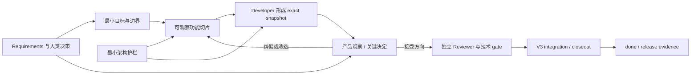

# Workflow V4 改进建议：以可观察功能切片驱动反馈，以最小护栏保护架构

> 状态：设计建议，尚未进入实现。
>
> 依据：当前 `problem.md`、Workflow V3 的实际文档、模板、Schema、检查器、状态脚本和测试结构。
>
> 核心原则：不推倒 V3 已经可靠的交付闭环，也不再叠加一套更重的主流程；在 V3 外层交付安全机制内，增加一个更短的产品反馈内环。

## 1. 结论先行

当前问题不是 V3 完全没有需求确认、人工批准、测试、Review 或架构意识。V3 已经具备这些能力，而且已经解决了早期版本的目录混放、`verified` 后无法收尾、需求校准不足以及多 lane 协作等问题。

真正的缺口是：V3 的强制对象主要是 task、delivery snapshot、lane、integration 和 closeout；它擅长证明“这批代码如何被安全交付”，但不能同样有力地证明“用户是否已经尽早看到正确的产品结果”“开发中出现的关键决定是否由人类作出”“当前实现是否仍在既定架构边界内”。

因此，V4 最适合采用以下结构：

1. 保留 V3 的 Requirements fingerprint、task contract、allowed paths、lane 隔离、canonical delivery、独立 Reviewer、gate、CAS、integration 和故障恢复。
2. 把正式开发的首要工作单元从“技术组件任务”改为“可观察功能切片”。
3. 在 Developer 完成其比例化测试并形成第一个可运行、可重复观察的 exact snapshot 后，先让人类判断产品方向，再投入独立 Reviewer 和集成成本。
4. 对开发期间出现的产品、数据、公共接口、依赖和架构决定建立结构化 `decision_log`；只阻断有实质影响的决定，不让人类审批纯机械实现。
5. 用少量、明确、可测试的架构护栏约束当前切片，而不是在功能出现前设计完整未来架构。
6. 让现有 `planning.level` 和 `risk` 真正驱动不同流程成本，修复“文字上按风险分级，代码中所有任务走同样门禁”的不一致。
7. 产品方向确认、代码 Review、集成 CI 和发布批准分别绑定各自证据，不能继续用一个 approval 表达不同含义。

一句话概括：**V4 应是“V3 交付安全外环 + 可观察产品反馈内环”，而不是 V3 的另一次全面重写。**

## 2. 对 `problem.md` 的理解

### 2.1 问题不是单纯“流程太多”

如果只删除文档、测试或门禁，功能可能更快出现，但 AI 仍可能把未确认假设固化为数据模型、公共接口和模块依赖，后续整体系统会为早期局部实现付出代价。

如果反过来增加完整 PRD、全面架构设计、更多审批和固定汇报，用户会更晚看到真实功能，反馈延迟反而继续放大。

所以需要解决的不是“流程多还是少”，而是以下顺序是否正确：

```text
先确认最小目标与不可突破的边界
→ 尽快形成一个可观察的端到端结果
→ 在有判断价值的时点让人类看见并决定
→ 再继续扩展、Review、集成和发布
```

### 2.2 V3 缺少的是产品反馈对象，不是更多流程状态

V3 已有四类状态：task、Backlog、lane effective 和 integration。继续增加 `demo_ready`、`waiting_human`、`direction_confirmed` 等主状态，会让组合状态更多、更难恢复。

V4 应把产品反馈和人类决定放入 task record 的结构化字段，由它们派生“当前是否等待人类”，而不是建立第五套主状态机。

### 2.3 后期整改是后果，不是根因

需求变化后让旧 acceptance、Review 和 integration 证据失效，本身是正确的安全行为。不能为了降低返工成本而继续使用已经不对应当前代码或当前需求的旧证据。

真正应该提前的是：

- 产品方向偏差的发现时间；
- 关键决定的提出时间；
- 架构越界的发现时间；
- 用户第一次能直接判断功能的时间。

当这些都发生在一个很小的切片内，即使需要重做，损失也有限。

## 3. 当前 V3 的直接证据与结构性缺口

| V3 已有能力 | 当前证据 | 仍然缺少什么 |
| --- | --- | --- |
| Requirements 中有 Must、场景和 `observable_result` | `workflow_check.py:184-264` | Requirements 是目标版本级批准，开发中出现的新语义决定没有对应协议 |
| Backlog 写明“按可独立验收的纵向结果拆分” | `mvp-backlog-template.md:24-30` | Backlog parser 与 governance gate 不验证任务是否真是纵向切片 |
| Developer 被要求实现最小端到端行为、运行真实用户/API 路径 | `implement-project-task/SKILL.md:22-35` | 最终 gate 只机械要求成功命令、验收文本和 Reviewer，没有产品观察证据类型 |
| task record 有 acceptance、risk、planning 和 human approvals | `task-record-template.json:14-46` | 没有 delivery contract、产品观察点、临时部分、关键决定和架构影响 |
| Human 负责事实、范围和高风险选择 | `protocol/AGENTS.md:40-49` | 角色声明没有转化为“何种决定何时必须暂停”的可执行规则 |
| ExecPlan 要求里程碑可运行或可恢复，并给出可观察证明 | `exec-plan-template.md:27-43` | small/medium 任务没有同等约束，且 planning/risk 的内部结构未被 V3 Schema 和 gate 充分执行 |
| STATUS 汇总 Requirements、Backlog、task 和 integration | `workflow_common.py:1401-1562` | 首屏不能回答“用户现在能试什么、哪里是临时的、还等哪个决定” |
| 独立 Reviewer 检查需求覆盖、正确性、安全和兼容性 | `review-project-change/SKILL.md` | Reviewer 位于完整交付之后，发现产品语义偏差时已经较晚 |
| Requirements impact 与 refresh-base 会清理旧证据 | `workflow_state.py:871-937`、`WORKFLOW.md:167-175` | 不同性质的证据作用域没有明确分开，容易发生不必要的重复确认 |

还有一个需要直接修正的不一致：协议和 `DECISIONS.md` 表述为“非简单任务”强制复盘，但 `workflow_check.py:561-570` 对所有 final gate 都要求 completed retrospective。当前所谓“按风险比例”主要改变计划文档深度，并没有真正改变主链成本。

## 4. 可借鉴的成熟流程原则

这里不照搬某个完整框架，只采用与当前问题直接相关的原则。

| 原则 | 来源 / 原始资料 | 对 V4 的具体含义 |
| --- | --- | --- |
| 尽早、持续交付有价值的软件；可工作的软件是首要进度度量 | [Agile Manifesto Principles](https://agilemanifesto.org/principles) | STATUS 和优先级首先围绕可运行结果，同时保留真正服务交付的文档与门禁 |
| Increment 必须可使用、经过验证，并可在正式 Review 前交给利益相关者 | [The Scrum Guide](https://scrumguides.org/scrum-guide.html) | 不增加固定演示会议；功能一旦具有判断价值就可触发观察 |
| 小批量能缩短反馈时间，尤其能约束 AI 一次生成过大的变更 | [DORA: Working in small batches](https://dora.dev/capabilities/working-in-small-batches/) | Backlog 一级单元优先是小型纵向功能，技术层任务不得长期取代产品结果 |
| 客户反馈、工作可见性和实验共同构成精益产品反馈 | [DORA: Customer feedback](https://dora.dev/capabilities/customer-feedback/) | 人类需要看真实页面、API、CLI 或数据行为，而不只是看 task 状态 |
| 松耦合的价值是让一个业务能力能独立修改、测试和交付 | [DORA: Loosely coupled teams](https://dora.dev/capabilities/loosely-coupled-teams/) | 架构护栏检查模块职责、依赖和契约；不把“微服务”当作默认答案 |
| ADR 只记录影响结构、关键质量属性或难以逆转的决定 | [Microsoft ADR guidance](https://learn.microsoft.com/en-us/azure/well-architected/architect-role/architecture-decision-record)、[ADR organization](https://adr.github.io/) | 不要求所有实现细节写 ADR；满足任一标准的决定即使只发生在单个 task 中，也进入永久决策记录 |
| 不同变更不必采用同一审批强度 | [Ship / Show / Ask](https://martinfowler.com/articles/ship-show-ask.html) | 只借用分级思想，不复用其状态或合并语义；原文的 Show 可在反馈前合并，V4 使用更保守边界 |

这些原则共同指向同一件事：**缩小交付批次和反馈批次，而不是简单减少质量要求。**

## 5. V4 目标模型：一个内环、一个外环、一组横向护栏



图中展示的是 `checkpoint.mode=required` 的主路径；`show_before_dependency` 允许 Reviewer 先行但在下游/集成前等待观察，`not_required` 则以已授权理由直接进入外环。

### 5.1 产品反馈内环

```text
切片合同
→ 最小端到端实现
→ 可观察证据
→ 人类判断或选择
→ 接受、纠偏、停止或延期
```

这个内环优化的是“从授权到第一次有效产品反馈”的时间。

### 5.2 V3 交付安全外环

```text
Developer evidence
→ independent Reviewer
→ acceptance / gate
→ verified
→ integration
→ closeout
→ done / released
```

这个外环继续负责代码正确性、证据一致性、集成和故障恢复。V4 初期不应重写 lane、lease、remote claim、canonical delivery 或 two-phase closeout。

### 5.3 架构护栏

架构护栏同时作用于两个环：它限制切片不得突破什么，并用自动或可复现检查确认实现仍在边界内。护栏不是提前设计整个系统，而是只保护已经知道不能被破坏的部分。

## 6. 改进一：把正式工作单元改成“可观察功能切片”

### 6.1 新增 `delivery_contract`

建议在 task record v4 中增加一个 `delivery_contract`，而不是新增一批独立状态文件。

```json
{
  "version": 4,
  "contract_fingerprint": "由脚本计算，不由执行者手填",
  "delivery_contract": {
    "kind": "core_slice",
    "supports_task_id": null,
    "requirement_ids": ["REQ-O-001", "REQ-F-001", "REQ-S-001"],
    "acceptance_ids": ["AC-001"],
    "checkpoint": {
      "mode": "required",
      "reason": "目标版本的首个焦点切片"
    },
    "validation_method": "browser",
    "observation_steps": ["打开预览", "执行核心操作", "检查可见结果"],
    "known_placeholders": ["当前仍使用测试数据"],
    "decision_refs": [],
    "execution_mode": "formal",
    "architecture": {
      "declared_impact": "within_guardrails",
      "guardrails": [
        {
          "id": "ARCH-G-001",
          "statement": "本切片不得反转已批准的模块依赖方向",
          "source": "user:decision-ref",
          "acceptance_id": "AC-003"
        }
      ]
    }
  },
  "decision_log": []
}
```

字段名可以在实现设计时调整，但这些语义不应丢失。`contract_fingerprint` 至少覆盖 request、Requirements baseline、scope、planning、risk、acceptance 和 `delivery_contract`；V4 checkpoint 必须同时绑定 `snapshot_id + contract_fingerprint + Requirements baseline`。这样即使代码未变，合同或架构边界被修改后，旧产品确认也不能被复用。V3 snapshot 算法保持不变。

`delivery_contract` 不应复制现有真相：可观察结果由 `acceptance_ids` 指向现有 acceptance，延后范围仍以 `scope.out` 为准，风险仍以 `risk` 为准。`known_placeholders`、观察方式、checkpoint policy 和切片类型是它新增的专属信息；STATUS 从这些规范来源派生，不能要求用户同步维护重复文字。

V4 第一阶段把切片专属 guardrail 直接内联，并用 `source + acceptance_id` 绑定已有事实与验证，避免立刻再建一个全局 registry。Coordinator 在授权时确认初始分类，checker 根据 changed paths、依赖、Schema、migration、公共接口和 lockfile 变化重新判断，Reviewer 独立核对；不能只信任 Developer 自报的 `declared_impact`。跨任务复用的 guardrail registry 和自动 fitness framework 延后到阶段 B。

### 6.2 `kind` 只保留四类

| kind | 含义 | 产品进度如何计算 | 产品观察要求 |
| --- | --- | --- | --- |
| `core_slice` | 能直接验证当前核心用户目标的最小纵向结果 | 计入产品进度 | 按 `checkpoint.mode` 决定观察门禁，不因 kind 自动制造固定审批 |
| `supporting` | core slice 不可缺少的最小前置工作 | 不单独宣称产品进度 | 必须绑定 `supports_task_id`，不能无限扩展为平台建设 |
| `hardening` | 已验证功能的安全、性能、兼容、恢复或质量增强 | 计入质量成熟度，不冒充新功能 | 若改变用户行为则升级为 checkpoint |
| `governance` | 工作流、CI、运维或治理变更 | 只计治理进度 | 不要求产品 checkpoint，但仍按风险验证 |

不建议再增加大量 task 类型。缺陷修复可根据是否改变用户行为归入 `core_slice` 或 `hardening`；纯研究若确实需要，应明确为可丢弃探索，不允许自动进入产品集成链。

`checkpoint.mode` 只允许三种：

- `required`：首个焦点切片、高不确定性、新用户行为或任一关键决策触发时使用；accepted checkpoint 是 `record-review` 的前置条件。
- `show_before_dependency`：实现完全可逆、风险已被现有合同覆盖时，可先进入 Reviewer，但在人类确认前不得 prepare integration，也不得让后续 task 把该行为当成已确认依赖。
- `not_required`：只有 approved Requirements 和 guardrails 已经唯一确定行为、且没有产品/数据/接口/架构触发器时使用；必须记录判定理由和来源。

`deferred` 是人类对某次观察请求的答复，不是 checkpoint mode，也不能满足上述任何门禁。

### 6.3 切片的 Definition of Ready

一个 `core_slice` 只有同时满足以下条件才可授权：

1. 只描述一个可以由人类直接判断的用户结果。
2. 明确观察方式：页面、预览、API、CLI、数据变化或其他可重复路径。
3. 明确当前仍是临时的部分，防止演示代码被误认为正式架构。
4. 明确本次延后的通用化、外围能力和非关键细节。
5. 绑定稳定 Requirements/acceptance IDs。
6. 列出本切片不可突破的架构护栏。
7. 明确 checkpoint mode、理由和来源。
8. 把已知的重要未决事项放入 `decision_log`，而不是让 Developer 自行补全。

### 6.4 Backlog 的约束

- 对以新功能为目标的 target release，当前最高优先级必须至少有一个 `core_slice`；incident、纯维护或纯治理阶段不强行制造产品切片。
- supporting task 必须用 `supports_task_id` 引用一个 Backlog core-slice ID（不要求对方 task record 已经创建），并说明为什么不能在该切片内部完成以及最小交付边界。
- 默认每个产品目标只允许一个未确认方向的 core slice 在制；该限制应可配置，并先以 advisory 方式验证。允许并行的 supporting lane 必须服务同一产品目标或明确不争夺当前反馈资源。
- 产品优先级由 Coordinator 在 Backlog 领取前处理；可在阶段 B 增加显式 `focus_slice_id`。integration queue 继续只负责已验证交付的串行化，不让 `workflow_lane.py` 猜测产品价值或“最短路径”。
- supporting task `done` 不得让 STATUS 宣称“核心功能已完成”。

这不是禁止技术任务，而是要求技术任务始终能回答“它服务哪个可观察结果”。

## 7. 改进二：Requirements 改为滚动细化，而不是一次前置所有细节

V3 的 Requirements fingerprint 和 impact 机制应该保留，因为它能阻止批准内容被静默改写。需要改变的是批准内容的批量大小。

建议按以下层次使用现有 Requirements：

1. **目标版本稳定核心**：用户、核心结果、明确非目标、安全/合规边界和不可突破的架构约束。
2. **当前 core slice 细节**：只细化现在要实现和观察的行为、场景与验收。
3. **未来候选内容**：留在 Backlog `draft`、PLAN、独立 draft Brief 或明确的非合同发现记录中，不提前固化为当前 approved Brief 的实现合同。

需要特别注意：当前 `requirements-gate` 会要求 users、outcomes、flows、scenarios 和 non-goals 等实体已确认，而且 fingerprint 包含 Requirements JSON 与整份 Brief Markdown；不能把 future draft 放在同一个 approved Brief 的“非合同段落”里，也不能把这些组中的 `unconfirmed` 项塞进去后仍声称 gate 可通过。只有当前 Schema 明确允许的 non-blocking question 或非 Must capability 可以留在 Brief 中。其余未来候选应在晋升为下一切片时建立新 revision，并走现有 impact 机制。

工作顺序变为：

```text
批准目标版本稳定核心 + 第一个 core slice
→ 实现并观察第一个切片
→ 根据反馈细化下一个切片
→ 必要时走现有 requirements-impact
```

这样仍有稳定 fingerprint，但不会为了开始第一个功能而先回答未来所有页面、数据和技术细节。

约束如下：

- 当前切片依赖的 blocking question 必须关闭。
- 当前 Brief 中与当前切片无关、且 Schema 允许的 non-blocking question 可以保留 owner 和 resolution target。
- 未确认内容不能进入 Developer scope、公共契约或数据模型。
- 添加未来切片时沿用稳定 REQ IDs；若影响活动任务，继续使用现有 impact/continue 机制。
- 默认在没有受影响活动 task 时晋升下一切片；否则明确接受现有 impact 和重新验证成本，不能把“每个切片都改同一 approved fingerprint”当成零成本滚动方式。
- 不为了避免 impact 而把 AI 假设写成 confirmed。

## 8. 改进三：增加事件触发的产品观察点

### 8.1 不使用固定汇报频率

以下事件用于决定 `checkpoint.mode` 或把原本非阻断的观察升级为阻断：

1. 目标版本首个焦点切片的核心路径首次可重复运行。
2. 即将把未确认假设固化为用户行为、数据结构或公共接口。
3. 另一个任务或模块即将依赖当前行为。
4. 实现结果明显偏离 approved Requirements 或出现新的实质取舍。
5. 准备进入独立 Reviewer、下游依赖或集成，但人类尚未看到新的实质产品行为。

不要求每轮、每天或每个 commit 汇报。

### 8.2 观察证据必须面向产品结果

按项目类型选择证据，不强制所有任务截图：

| 类型 | 合格证据示例 |
| --- | --- |
| 页面/交互 | preview URL、截图或短视频、操作步骤、预期和实际结果 |
| API | 可重放请求、响应、状态码、鉴权条件和失败样例 |
| CLI | 完整命令、输入、退出码和关键输出 |
| 数据处理 | 固定输入、前后数据差异、校验查询和异常输入结果 |
| 后台任务 | 触发方式、状态变化、可观察日志/指标和失败恢复结果 |
| 基础能力 | 最小调用者示例、契约测试和可验证输出 |

证据还必须写明：

- 当前 snapshot/commit 与 `contract_fingerprint`；
- 构建或制品 digest、环境和非秘密配置标识；
- 固定输入、数据 fixture，以及使用真实数据还是测试数据；
- 可重放步骤、观察时间和观察者来源；
- 对应 Requirements/acceptance IDs；
- 哪些部分已经真实工作；
- 哪些部分仍是占位、模拟或临时实现；
- 已知限制和下一步；
- 人类现在需要判断什么。

这些内容组成结构化 `observation_receipt`。一个可变 preview URL 不能单独通过 checkpoint gate；URL、API transcript、日志和截图不得保存 token、cookie、PII、秘密或带签名 query，STATUS 只显示脱敏入口，敏感证据使用受控引用。

### 8.3 required 产品 checkpoint 放在 Reviewer 之前

推荐顺序：

```text
Developer 完成一个很小的 core slice
→ record-developer，形成 exact snapshot
→ checkpoint readiness gate
→ 提交 product_checkpoint 与 observation receipt
→ Human accepted：进入独立 Reviewer
→ Human changes_requested：snapshot 失效，回到 Developer
```

当前 `record-developer` 之前已经要求 Developer 执行 focused checks、比例化 broader regression 和 build 等验证；readiness gate 还应确认核心路径可运行、基础 smoke/contract checks 通过，并且没有已知 P0/P1、安全、隐私、数据破坏或外部副作用风险。人类负责判断产品方向，不应被当作第一轮 QA。

因此第一阶段能前移的是产品反馈相对独立 Reviewer、排队和集成的位置，不能宣称省掉 Developer 的既有验证。展示必须位于隔离预览或受控测试环境，默认使用测试数据、无生产凭据和无非必要外部副作用；高风险任务可要求最小独立安全检查先于产品展示。

checkpoint 不是技术验收，也不是发布批准。它只回答：“这个 exact snapshot 所表达的产品方向，是否符合人类当前预期？”

人类答复至少区分四种结果：

- `accepted`：方向成立；`required` 模式可以进入 Reviewer，`show_before_dependency` 模式可以解除其下游/集成门禁；
- `changes_requested`：保留观察历史，使当前 snapshot 的产品确认失效，返回 Developer；
- `stopped`：停止该切片，不让 sunk cost 推动继续扩展；Coordinator 使用现有 `release --abandon` 清理 runtime claim/queue，并把 Backlog 置为 `blocked manual:*` 或 `removed`，不能声称 completed/done；
- `deferred`：只有人类可以选择，必须写明原因和最晚观察点；它仍是未解决状态，不能通过对应的 Reviewer、下游依赖或 integration gate。若确有“先集成后观察”的特殊需求，应另建显式 risk acceptance 和隔离/feature-flag 方案，不能把 deferred 冒充 accepted。

## 9. 改进四：把开发中的人类决定变成一等对象

### 9.1 使用统一 `decision_log`

产品 checkpoint 与开发中出现的关键决定使用同一个结构化日志，避免再造独立 checkpoint 状态机；但 Schema 必须按 `kind` 使用 discriminated union，不能让所有类型共用一组含糊字段。

```json
[
  {
    "id": "HD-001",
    "kind": "product_checkpoint",
    "status": "resolved",
    "blocking": true,
    "binding": {
      "snapshot_id": "...",
      "contract_fingerprint": "...",
      "requirements_baseline": {"brief_id": "REQ-001", "revision": 1, "approval_fingerprint": "..."}
    },
    "observation_receipt": {"artifact_digest": "...", "environment": "preview", "evidence_refs": ["..."]},
    "decision_fingerprint": "...",
    "resolution": {
      "outcome": "accepted",
      "decided_by": "human-owner",
      "decided_at": "...",
      "source": "external-receipt",
      "rationale": "核心行为符合当前预期"
    }
  },
  {
    "id": "HD-002",
    "kind": "product_decision",
    "status": "open",
    "blocking": true,
    "question": "提交前是否必须显示预览？",
    "options": [
      {"id": "A", "label": "先预览后确认", "impact": "更易理解，多一步操作"},
      {"id": "B", "label": "直接提交", "impact": "更快，但误操作恢复更复杂"}
    ],
    "recommendation": {"option_id": "A", "reason": "当前目标优先降低误操作"},
    "decision_fingerprint": "...",
    "requirements_baseline": {"brief_id": "REQ-001", "revision": 1, "approval_fingerprint": "..."},
    "resolution": null
  }
]
```

第一阶段只支持四种 kind：`product_checkpoint`、`product_decision`、`architecture_decision` 和 `risk_acceptance`。checkpoint 的终态 resolution 使用 `accepted | changes_requested | stopped`；人类选择 `deferred` 时只追加带原因和最晚观察点的 deferral 记录，entry 仍保持 open。其他决定使用 `selected_option_id`，并同样记录 `decided_by/at/source/rationale`。阻断哪些命令由 kind、`blocking`、checkpoint mode 和当前 phase 在代码中推导，不允许请求者用自由文本 `blocks` 自行放宽门禁。

当前项目的轻量 JSON Schema validator 只支持既定关键字，并会拒绝未知关键字。若 discriminated union 需要 `oneOf`、`if/then` 等当前未实现能力，必须先扩展 validator 并补回归；另一可接受方案是 Schema 校验公共结构、`workflow_check.py` 对每个 kind 做严格必填字段检查。不能把不受支持的关键字写进 Schema 后假设它会生效。

第一阶段的 `blocking=true` 冻结整个 task 的封存/Review；`blocking=false` 只记录而不阻断。若需要“受影响部分暂停、其余部分继续”，应拆成独立 task/lane，因为当前 V3 lane 没有可证明安全的子路径暂停状态。

### 9.2 三种决策处理方式

以下是 V4 自己的决策分级。Ship/Show/Ask 只启发了“不同变更不必采用同一审批强度”，不作为本节状态语义或合并策略的依据：

| 方式 | 适用情况 | AI 可以做什么 | 人类何时介入 |
| --- | --- | --- | --- |
| `execute_within_guardrails` | 纯内部、可逆、已有规则完整覆盖 | 直接实现并在 handoff 中记录必要假设 | 不需要逐项审批 |
| `show_before_dependency` | 用户可见但容易撤回，且不影响数据/公共契约 | 先做最小版本形成 checkpoint | 下游依赖或集成前确认 |
| `ask_before_implementation` | 高影响或难以逆转 | 只分析选项、影响和推荐，不固化选择 | 人类选择后才能实施受影响部分 |

无法判断属于哪一类时，向上升级一档。

### 9.3 必须 `ask_before_implementation` 的触发器

- 功能范围、优先级或明确非目标改变；
- 核心用户流程、页面结构或重要交互改变；
- 默认值、失败策略会产生明显用户或业务后果；
- 数据对象、字段语义、数据保留、删除或迁移方式改变；
- 公共 API、事件、Schema 或兼容承诺改变；
- 身份、权限、隐私、安全、合规边界改变；
- 新增或替换核心依赖、第三方服务、持久化或基础设施；
- 模块职责、依赖方向或跨域边界改变；
- 生产成本、发布方式、回滚能力受到实质影响；
- 破坏性、不可逆或高迁移成本的决定。

### 9.4 不应要求人类逐项审批的内容

- 已确认边界内的变量名、局部函数拆分和格式化；
- 不改变行为的局部重构；
- 按现有模式补测试、错误处理和类型；
- 可逆且不影响公共契约的内部实现细节；
- 已被明确 guardrail 和 acceptance 唯一确定的机械工作。

### 9.5 决策请求的展示要求

对于 `product_decision`、`architecture_decision` 和 `risk_acceptance`，AI 不能只给一个抽象问题或单一推荐。一个合格请求应包含：

1. 人类实际要决定什么。
2. 2—3 个可比较方案。
3. 每个方案对功能、体验、数据、成本、风险和架构的差异。
4. 可逆性和最晚决策点。
5. AI 推荐及理由，但推荐不能冒充决定。
6. 是否阻断当前 task；需要部分继续时应如何拆分 task。

人类答复必须绑定 exact `decision_fingerprint`；问题、选项、作用域、Requirements baseline 或 checkpoint 证据发生实质变化后，旧答复不能继续适用。

`record-decision` 只保存选择和来源，不应把选项文本自动当成新的 task contract。若选择改变 scope、acceptance、risk 或内联 guardrail，Coordinator 必须通过受控 mutation 把结果落实到对应规范字段，把 decision ID/selected option 加入 `delivery_contract.decision_refs`，并重新计算 `contract_fingerprint`；若改变 approved Requirements，则继续走 requirements-impact。只有决定与更新后的合同一致后，Developer 才恢复实施。

## 10. 改进五：用最小架构护栏代替完整前置架构

### 10.1 只维护少量当前有效护栏

初始护栏只覆盖以下内容中真正适用的部分：

- 模块职责和依赖方向；
- 数据所有权、Schema 兼容和迁移边界；
- 公共接口与版本兼容；
- 身份、权限、安全和隐私边界；
- 外部依赖和故障隔离；
- 部署、回滚和临时代码退出条件。

不应为了填写模板而创建空洞的全面架构文档。

第一阶段按 6.1 所述把 task 所需护栏内联并纳入 `contract_fingerprint`；只有出现跨 task 复用需求后，阶段 B 才把它们提升为 project-owned、带稳定 ID、来源、责任人、版本/fingerprint 和 fitness check 的规范集合。

### 10.2 每个 task 声明架构影响

| architecture impact | 含义 | 所需动作 |
| --- | --- | --- |
| `none` | 不触及任何架构边界 | 普通验证 |
| `within_guardrails` | 触及边界但符合已批准规则 | 运行对应 fitness checks |
| `changes_guardrail` | 将改变模块、数据、公共契约或依赖方向 | 先建立 blocking decision；影响系统结构、关键质量属性或难以逆转时写 ADR，即使决定只发生在一个 task 内 |

### 10.3 护栏尽可能转成 fitness checks

可用检查包括：

- import/dependency 边界检查；
- API/事件/Schema 契约测试；
- 数据迁移前向、回滚和兼容测试；
- 权限矩阵与跨用户隔离测试；
- dependency allowlist 和许可证检查；
- feature flag 默认状态、作用域和到期检查；
- 模块调用方向或循环依赖检查。

检查不一定全部自动化，但 `within_guardrails` 不能只有一句“看起来没问题”。

### 10.4 处理快速原型

如果某项不确定性只能通过原型消除，必须明确：

- 不增加第五种 task kind，而把 `execution_mode` 设为 `exploratory`；
- 原型是可丢弃探索，不是正式产品进度；
- 默认不修改正式数据、公共接口或生产依赖；
- 原型分支不得自动进入 integration；
- 人类决定 `discard` 或 `promote`；
- `promote` 不等于直接合并，仍需按正式 delivery contract、架构护栏和 Review 重建或验证。

`prepare-integration` 对 `execution_mode=exploratory` 永远 fail closed；promotion 会创建或重建 `execution_mode=formal` 的正式合同，不能原地改一个字段就绕过门禁。

这能同时保护“快速看见结果”和“临时代码不成为永久架构”。

## 11. 改进六：让风险比例真正改变流程成本

V4 不需要另建复杂 profile 系统。先让现有 `planning.level`、task `kind` 和 `risk` 被 Schema 与 gate 真正读取即可。

### 11.1 建议的最小分级

| 情况 | 所需流程 |
| --- | --- |
| small + 无风险触发 + supporting/hardening/governance | 短 task contract、相关测试、窄范围独立 Review；无固定 product checkpoint；复盘仅在发现流程问题时要求 |
| core_slice | delivery contract、可观察证据、按 checkpoint mode 执行的事件门禁、独立 Reviewer、正常 gate |
| medium 或存在用户行为/数据/接口影响 | ordered plan、必要 decision requests、相关 guardrail checks、独立 Reviewer |
| large/high-risk 或安全/隐私/破坏性/难逆架构 | ExecPlan、事前人工决定、必要 ADR、扩展测试与恢复计划、完整 Reviewer |

同一 task 命中多行时取最高要求：`effective tier = planning.level 与所有 risk trigger 的最高等级`。`core_slice` 只增加产品反馈要求，绝不能降低 sensitive data、destructive change 或 irreversible architecture 触发的高风险门禁。

### 11.2 所有档位仍保留的安全底线

- task 授权和 exact base；
- allowed paths/resource keys；
- 干净 delivery commit；
- 与影响匹配的真实验证；
- 独立审查；
- 集成和发布状态不得混称；
- 故障时保留可恢复证据。

V4 第一阶段仍沿用当前独立 Reviewer。未来只有 provider receipt 能机械证明 Reviewer 独立性、最新 diff 批准、等价验收清单、所需检查以及无未授权 bypass 时，才可按显式适配规则认定为等价；仅仅启用 branch protection 并不自动等价于 V4 Reviewer。

### 11.3 首先修复复盘门禁不一致

建议把复盘改为触发式：

- medium、large/high-risk 强制；
- 出现 repeated problem、guidance gap、deterministic check candidate 时强制；
- small 且无任何触发时允许记录 `not_required` 和原因。

这样既保留持续改进，也不让机械复盘消耗每个微小任务。

## 12. 改进七：按证据作用域失效，不混用批准

### 12.1 五类证据分别回答不同问题

| 证据 | 回答的问题 | 建议绑定对象 |
| --- | --- | --- |
| Requirements approval | 我们要做什么 | brief/revision/fingerprint |
| Human decision | 人类选择了哪个产品或架构方案 | decision scope + requirements baseline |
| Product checkpoint | 人类看过的实际行为是什么 | exact snapshot + contract fingerprint + Requirements baseline + observation receipt |
| Code Review / gate | 这批代码是否满足技术与合同要求 | delivery hash/snapshot |
| Integration / release | 什么进入目标分支、部署了什么 | target candidate / artifact digest |

`record-approval` 当前服务 local bootstrap，不应直接复用为产品决定，否则会继续混淆 task、target ref、snapshot 和产品语义。

### 12.2 保守的失效规则

- delivery 内容变化：旧 product checkpoint 和 Code Review 失效。
- 人类已接受的产品偏好或架构决定：只在其 Requirements、决策范围或约束变化时失效；不能因无关 commit SHA 变化自动忘记。
- rebase 或目标分支变化：Code Review/集成证据按当前安全策略重新验证；产品 checkpoint 是否需重做由行为证据和相关依赖变化决定，默认保守重验。
- Requirements 影响当前切片：复用现有 impact 机制，相关决定和 checkpoint 失效。
- artifact 重建：发布批准失效，不应倒推用户从未作出先前产品选择。

`changes_requested` 使用一个共享、版本化的 V4 reset helper：phase 回到 developer、status 回到 in_progress；verification/developer/review 重置；acceptance 回到 pending 并清空 evidence；snapshot-bound approvals 清空；integration 回到 not_ready；retrospective、rule proposals 和 remaining risks 重置。decision history 保留，但旧 checkpoint 因 snapshot/contract 不匹配而失效。该 helper 只允许在 integration 尚未 pending/queued 时使用，并与 refresh-base、Requirements continuation 的失效语义保持一致。

V4 增加 `closeout_fingerprint_version`。V3 record 永远使用 V3 算法；V4 算法包含 `contract_fingerprint`、当前有效 decision/checkpoint canonical 摘要、integration 和 Backlog。升级计划必须识别 prepared/pending closeout，不能用新算法重算其历史 fingerprint。

V4 第一阶段可以继续对 checkpoint 使用 exact snapshot 的保守绑定；选择性失效应在有充分测试后逐步开放，不能一次放松所有门禁。

## 13. 改进八：STATUS 首先展示产品状态

`STATUS.md` 仍然是生成快照，不成为新的真相来源。但人类可读部分应先回答：

1. 当前核心目标是什么。
2. 当前最高优先级 core slice 是什么。
3. 用户现在能实际尝试什么，入口和步骤在哪里。
4. 最近一次产品 checkpoint 的结果是什么。
5. 哪些内容仍是临时、模拟或延期。
6. 当前有哪些 blocking human decisions。
7. 架构护栏是否通过。
8. 然后才显示 task/lane/verification/integration 技术状态。

建议的人类可读摘要：

```text
当前核心结果：用户可以……
可观察入口：preview / API / CLI / data proof
产品方向：awaiting_human | accepted | changes_requested | not_required
待决定：HD-003（数据保留方式，阻断 schema 实现）
临时部分：测试数据；尚未接生产鉴权
架构护栏：3/3 passed
技术交付：developer snapshot ready；review 尚未开始
```

Stop Hook 只提示下一条安全动作，例如“等待 HD-003”或“当前 snapshot 被 changes_requested，需要回到 Developer”；不能自动批准、改变决定或执行集成。

## 14. 推荐的完整执行顺序

```text
1. 批准目标版本稳定核心和当前 core slice
2. Coordinator 在 Backlog 明确当前 focus core slice，supporting 工作只服务该焦点
3. 建立 task record v4：delivery_contract + 最小架构护栏
4. 授权并进入现有 lane
5. Developer 实现最小端到端结果
6. 遇到关键决定：request-decision
   - blocking → 第一阶段冻结整个 task 的封存/Review
   - non-blocking → 记录但不阻断
   - 需要部分继续 → 拆分独立 task/lane
7. record-developer，形成 exact snapshot
8. 按 checkpoint mode 写 product_checkpoint 和 observation receipt
9. Human：
   - required + accepted → Reviewer
   - show_before_dependency → Reviewer 可先进行，但 accepted 前不能下游依赖或集成
   - not_required → 使用已授权理由继续
   - changes_requested → snapshot 失效，返回 Developer
   - stopped → release --abandon，并将 Backlog blocked/removed
   - deferred → 仍等待，不通过对应门禁
10. 独立 Reviewer → complete-task → gate → verified
11. 复用现有 local_bootstrap 或 remote_pr_ci
12. closeout → done；发布仍需独立 release evidence
13. 根据真实反馈滚动细化下一 core slice
```

这条顺序的关键变化只有一个：**产品方向确认从任务末尾前移到第一个小型 delivery snapshot 之后、完整 Reviewer 和集成之前。**

## 15. 命令与职责建议

### 15.1 只新增两个 state 子命令

```text
workflow_state.py request-decision <record> --decision-json <file> [--apply]
workflow_state.py record-decision <record> --decision-id <id> --expected-fingerprint <sha256> --resolution-json <file> [--apply]
```

`product_checkpoint` 是一种 decision kind，因此不需要再新增 `checkpoint.py`、独立数据库或另一组生命周期命令。

### 15.2 现有工具职责保持不变

| 工具 | V4 职责 |
| --- | --- |
| `workflow_state.py` | 追加/解决 decision，generation CAS，并在 integration 尚未开始时调用统一 V4 reset helper |
| `workflow_check.py` | 只读检查 delivery contract、未解决 blocking decision、checkpoint 与 snapshot 绑定、risk/plan/guardrail 规则 |
| `workflow_lane.py` | 继续只负责 claim、resource、queue、lease、recovery，不承载产品语义 |
| Stop Hook | 只提示等待的决定或下一安全命令，不写人类决定 |
| `STATUS.md` | 派生显示产品结果和下一人类动作，仍不是真相源 |

### 15.3 门禁放置

- preflight：检查 `delivery_contract`、contract fingerprint 输入、supporting 绑定、checkpoint mode 和已知 blocking decisions。
- record-developer：存在任一 open blocking decision 时拒绝封存；non-blocking decision 不冻结 lane。需要部分继续时先拆 task。
- record-review：`checkpoint.mode=required` 且当前 `snapshot + contract + Requirements` 没有 accepted checkpoint 时拒绝；`show_before_dependency` 可 Review，但不能把它误报为方向已确认。
- complete-task、gate、prepare-integration：重复检查，防止绕过。
- V4 第一阶段的 `request-decision` 只允许 `integration.status=not_ready`。一旦 pending/queued/integrating，命令 fail closed；现有 `invalidate-integration` 只改 task record、不会自动删除 runtime queue，不能单独作为恢复方案。
- 若排队后发现关键问题，使用显式 Integrator/Coordinator 放弃路径：停止集成、使记录失效、`release --abandon` 清理匹配 runtime queue/claim，并把工作重建为新的或重新授权的 task。支持安全原地 dequeue/reopen 需要新的事务设计，延后到阶段 B。
- `changes_requested`：仅在 integration not_ready 时调用第 12.2 节的统一 reset helper，保留 decision history 并回到 Developer。

## 16. 对现有文件的针对性修改

| 文件 | 建议修改 |
| --- | --- |
| `payload/.codex-workflow/schemas/task-record-v4.schema.json` | 新增并严格定义 `delivery_contract`、`decision_log`、planning、risk 和复盘的内部结构 |
| `payload/.agents/skills/orchestrate-project-task/references/task-record-template.json` | 提供 core slice、supporting、架构护栏与 decision 示例 |
| `payload/.agents/skills/orchestrate-project-task/references/mvp-backlog-template.md` | 阶段 B 增加 kind、supports、focus；新列只能追加在现有列之后或使用版本化 metadata，不能破坏当前固定列 parser |
| `payload/.agents/skills/orchestrate-project-task/SKILL.md` | 改为滚动细化、优先 core slice、事件触发人类观察 |
| `payload/.agents/skills/implement-project-task/SKILL.md` | 要求遇到 trigger 创建 decision request，不得自行固化；先完成最小可观察结果 |
| `payload/.agents/skills/review-project-change/SKILL.md` | 除技术检查外，核对 accepted checkpoint、临时部分和架构护栏 |
| `payload/.codex-workflow/bin/workflow_state.py` | 增加 request/record decision、CAS、幂等、冲突和失效规则 |
| `payload/.codex-workflow/bin/workflow_check.py` | 增加 delivery/decision/product/architecture gates，并真正读取 planning/risk |
| `payload/.codex-workflow/bin/workflow_common.py` | 解析新 Backlog 语义，生成产品优先 STATUS 摘要和 fingerprint |
| `payload/.codex-workflow/bin/codex_stop_hook.py` | 显示精确 decision ID 与下一动作，不自动改变状态 |
| `payload/.codex-workflow/governance/DECISIONS.md` | 保存影响系统结构、关键质量属性或难以逆转的 accepted 决定；其他 task-local 选择留在 record |
| `payload/.codex-workflow/docs/WORKFLOW.md`、`README.md`、`功能.md` | 解释双环、产品 checkpoint、decision 权限和风险比例 |
| `install.py`、`verify_package.py` | 增加 V4 package 文件、V3/V4 双读和安全升级检查 |
| `tests/` | 增加产品反馈、decision CAS、架构护栏、迁移和完整闭环测试 |

## 17. 安装、迁移与兼容策略

### 17.1 不原地批量改写 V3 task record

- V2：继续只读历史兼容。
- V3：按原语义完成、集成和 closeout。
- V4：新任务使用 delivery/decision 门禁。

旧脚本遇到 version 4 应 fail closed，不能忽略未知字段继续执行。

### 17.2 活动任务处理

- 默认让活动 V3 task 按 V3 收尾。
- 若确实要迁移，必须先 dry-run，列出 lane、queue、pending closeout、snapshot 和将失效的证据，再由人类批准。
- 不在 integration 写入窗口中修改协议版本。
- 跨机器协作时，所有参与机器必须先升级到能理解 V4 record 的版本。

### 17.3 两阶段升级

1. `--plan-upgrade`：严格零写入，报告 V3 records、live lanes、queue、pending closeout、项目自定义治理文件和精确变更。
2. 显式 apply：执行 package-owned 更新，以及计划中逐项列出的 project-owned 窄范围迁移；两者处于同一 backup/journal/rollback 事务，不能用普通 reinstall 静默覆盖项目状态。

## 18. 实施顺序

### 阶段 A：先实现最小反馈门禁

优先级最高：

1. task record v4 的 `delivery_contract` 与 `decision_log`。
2. `request-decision` / `record-decision`。
3. `contract_fingerprint` 与 exact-snapshot observation receipt/checkpoint。
4. discriminated decision schema、统一 reset helper，以及 preflight/record-review/gate 的防绕过检查。
5. STATUS/Stop Hook 显示产品结果与待决定项。
6. V3/V4 双读、版本化 closeout fingerprint 和安装/迁移回归。

这一阶段复用所有 V3 integration 和恢复机制；不同时改 Backlog 列、Requirements 模型、全局 guardrail registry、risk/retrospective、provider receipt 或远端 merge 策略。

### 阶段 B：增强滚动细化与架构护栏

1. Backlog 对 core/supporting/focus 的版本化 metadata、机械验证和 WIP 约束。
2. 滚动 Requirements 的操作验证；若现有“稳定核心 + 当前切片”仍造成过宽影响，再设计切片级 fingerprint/impact，而不是静默放宽 V1 gate。
3. project-owned guardrail registry、fitness check 证据和独立 impact 分类。
4. planning/risk/retrospective 的风险比例门禁。
5. 决策 supersede、幂等与更细作用域失效。

### 阶段 C：再评估远端重复治理

V4 核心稳定后，再研究 provider receipt、受保护分支和 merge queue 能否减少本地与远端重复证明。GitHub merge queue 会在 PR 应用于最新目标分支和队列前序变更后重跑 required status checks，但不会重新执行人类 Review；当前适用于组织拥有的公共仓库，或 GitHub Enterprise Cloud 组织的私有仓库。branch protection 的 stale approval、latest-push approval、expected check source 和禁止管理员 bypass 也都是需要显式核实的配置，且 GitHub 可把 `skipped`/`neutral` 视为满足 required check，V4 adapter 若要求严格 success 必须额外收紧。[GitHub protected branches](https://docs.github.com/en/repositories/configuring-branches-and-merges-in-your-repository/managing-protected-branches/about-protected-branches)、[GitHub merge queue](https://docs.github.com/en/pull-requests/collaborating-with-pull-requests/incorporating-changes-from-a-pull-request/merging-a-pull-request-with-a-merge-queue)

在这之前，不改写当前经过大量回归覆盖的 strict-ff、remote claim 和 closeout 机制。保留 strict-ff 是第一阶段的兼容选择，不代表 GitHub 的通用目标模型；未来 adapter 应验证仓库实际 merge topology、PR head、merge-group/result commit 和最终树，不能统一假设 `head == result`。[GitHub merge methods](https://docs.github.com/en/repositories/configuring-branches-and-merges-in-your-repository/configuring-pull-request-merges/about-merge-methods-on-github)

## 19. 必须新增的验证场景

### 19.1 Schema 与 preflight

- core slice 缺 acceptance/Requirements refs、observation method、checkpoint policy 或 contract fingerprint 时 fail closed。
- supporting 缺 `supports_task_id` 时 fail closed。
- planning/risk 内部字段缺失或不一致时 fail closed。
- `changes_guardrail` 没有 accepted human decision 时 fail closed。

### 19.2 Decision 完整性

- request 和 record 默认 dry-run、`--apply` 才写入。
- 两个并发答复只有一个 generation CAS 成功。
- 相同答复幂等；不同答复必须显式 supersede，不能最后写入者覆盖。
- resolution 必须有非空外部来源/receipt；本地 metadata 只作为合作式证据，测试不能假装证明填写者在现实中一定是人类。
- Requirements baseline 改变后，受影响 decision 不再有效。
- open blocking decision 冻结整个 task；自由文本不能改变门禁范围。

### 19.3 Product checkpoint

- UI、API、CLI、data 四种证据均有 fixture；不能把截图设为唯一方式。
- checkpoint 必须绑定当前 exact snapshot、contract fingerprint、Requirements baseline、artifact/environment/fixture observation receipt。
- 新 delivery commit 后旧 checkpoint 不能通过 record-review。
- `changes_requested` 保留 decision history、调用完整 reset helper，并且只允许 integration not_ready。
- `deferred` 不能满足 record-review、dependency 或 integration gate。
- accepted checkpoint 不等于 verified、done 或 released。

### 19.4 架构护栏

- within-guardrails 缺对应 check 证据时失败。
- dependency、contract、schema compatibility、migration/rollback 至少各有代表性 fixture。
- 原型不能直接 prepare-integration。

### 19.5 风险比例

- small/no-trigger 可记录 retrospective `not_required`。
- medium/high-risk 或出现流程问题时仍强制复盘。
- high-risk 缺 ExecPlan/decision/恢复计划时失败。

### 19.6 兼容与恢复

- 现有 V3 测试全部保持通过。
- V3 task 可以继续 closeout；V4 task 才启用新门禁。
- V3 closeout/state fingerprint 保持兼容；V4 fingerprint 能检测 delivery contract 或有效决定漂移。
- pending/queued task 的新 decision request fail closed；显式 abandon 能删除匹配 runtime queue/claim，且不会伪造 done。
- refresh-base、requirements impact、rebuild/recover/reconcile 与 V4 decision history 兼容。
- Windows 使用当前 `sys.executable`，继续覆盖故障注入、原子写入和 staged rollback。

## 20. 建议观察的指标

这些指标用于发现瓶颈，不在初期变成固定 SLA：

- 从 implementation authorization 到首个可观察结果的时间；
- checkpoint ready 到人类反馈的等待时间；
- verified 到 integrated 的停留时间；
- 因未确认产品/架构决定导致的返工比例；
- core slice 与 supporting task 的数量和在制比例；
- 同时未确认方向的 core slice 数量；
- 流程等待时间与实际实现时间的比例；
- 因 rebase 或 Requirements 变化重复执行的证据链比例；
- `changes_guardrail` 被及时发现还是在 Reviewer/集成后发现。

先记录基线，再决定是否需要进一步简化某个门禁。没有数据前，不应把感觉直接变成永久规则。

## 21. 主要风险与控制

| 风险 | 可能后果 | 控制方式 |
| --- | --- | --- |
| 新增字段反而增加复杂度 | 使用者填写更多模板 | 只增加 `delivery_contract` 和 `decision_log` 两个核心对象；其他均嵌套或派生 |
| 人类成为等待瓶颈 | lane 长时间停滞 | 只事件触发；批量呈现非阻断决定；每项给选项、影响和推荐 |
| AI 把所有问题都升级 | 沟通负担过大 | 明确 execute/show/ask 边界；纯内部可逆选择不记录 |
| AI 为了速度制造演示代码 | 临时实现进入正式架构 | known placeholders、架构护栏、原型隔离与 promotion gate |
| 产品 checkpoint 被当成测试 | 技术缺陷进入集成 | checkpoint 之后仍需独立 Reviewer、gate 和 CI |
| 产品 checkpoint 被当成发布批准 | 状态再次混称 | 分开 product direction、verified、done、released 四种事实 |
| preview/evidence 不可复现或泄密 | 人类看错版本，或敏感信息进入 Git | observation receipt 绑定 digest/environment/fixture；证据脱敏并使用受控引用 |
| 选择性失效过于宽松 | 旧决定或证据被错误复用 | 第一阶段 exact-snapshot 保守绑定；有回归覆盖后再细化 |
| V4 升级破坏活动 V3 lane | 任务或恢复证据丢失 | V3/V4 双读、活动任务默认不迁移、plan-upgrade 零写入 |

## 22. 明确不建议做的事

1. 不重写 V3 lane、lease、remote claim、canonical delivery 和 closeout。
2. 不增加新的全局主状态机或独立产品反馈数据库。
3. 不要求每轮、每天、每个 commit 固定汇报。
4. 不让人类审批所有代码细节。
5. 不为每个 task 写完整 ADR 或完整未来架构。
6. 不把截图设为所有项目的唯一证据。
7. 不把快速原型直接当作正式产品提交。
8. 不因为“功能第一”而删除测试、安全、隐私、兼容和恢复底线。
9. 不让 Hook 自动批准、merge、closeout 或发布。
10. 不把本地 JSON 中的 `approved_by`、Agent 身份或合作式锁当作安全信任根。
11. 不在 V4 第一阶段同时改造产品反馈、远端 merge 策略、发布系统和所有 Schema。
12. 不用新增文档数量衡量 V4 是否成功，应看反馈是否更早、偏差是否更小。

## 23. V4 第一阶段的验收定义

V4 第一阶段只有在以下行为全部成立时才算解决了当前问题的核心部分：

1. 一个新功能默认先产生可观察 core slice，而不是先完成一组横向技术任务。
2. 人类可以从 STATUS 或 checkpoint 直接知道“现在能试什么、哪里仍是临时的”。
3. AI 遇到产品、数据、公共接口、依赖或架构实质决定时，能结构化展示选项；blocking 决定冻结 task，部分继续必须拆分。
4. `checkpoint.mode=required` 的切片在独立 Reviewer 前获得 `snapshot + contract + Requirements + receipt` 产品方向确认；纠偏调用完整 reset helper。
5. 内联架构护栏进入 contract fingerprint，并由 Coordinator、checker 和 Reviewer 独立核对，而不是只信任 Developer 自述。
6. product checkpoint、技术 verified、integration done 和 released 不会被混称。
7. V3/V4 closeout fingerprint 分版本；所有现有 V3 integration、故障恢复和历史 task 保持兼容。
8. pending/queued 后的新决定 fail closed，不留下僵尸 queue 或伪造 closeout。
9. 没有新增固定汇报频率、第五套主状态机或全面前置架构设计。

small/no-risk 的复盘减负、滚动 Requirements、Backlog focus/WIP 和全局 fitness framework 属于阶段 B；它们完成后，才算覆盖 `problem.md` 中“流程成本随风险缩放”的全部目标。

## 24. 最终建议

优先实施一个“小而硬”的 V4：

- 只增加 `delivery_contract` 和 `decision_log` 两个核心数据对象；
- 只增加 `request-decision` 和 `record-decision` 两个状态命令；
- 对 required 模式，把产品 checkpoint 放在第一个小型 exact snapshot 之后、独立 Reviewer 之前；
- 把最小架构护栏内联进切片合同，并纳入 contract fingerprint 与 Reviewer 核对；
- 让 STATUS 首先显示产品结果和下一人类动作；
- 下一阶段再让现有 planning/risk 真正改变流程成本，并推进滚动细化与 Backlog focus；
- 其余交付、集成和恢复能力继续复用 V3。

这套改进直接回应 `problem.md` 的四个目标：核心功能更早形成真实结果，人类在有判断价值的时点看见并作出主要决定，AI 不再静默固化关键假设，当前功能又被最小可测试架构边界保护。它同时控制 V4 自身的复杂度，避免工作流再次成为产品反馈的主要阻力。
